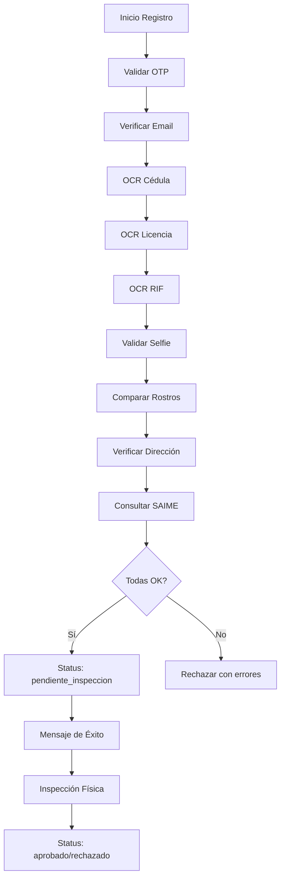
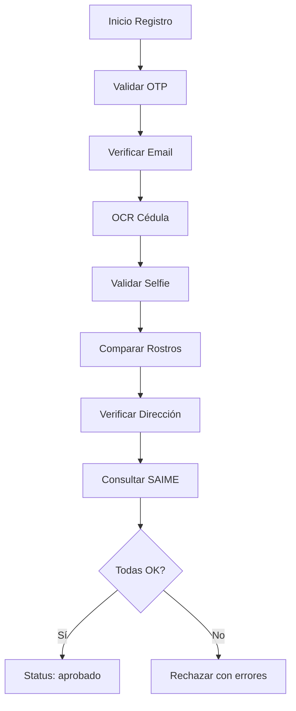

# Verificación Automática - Taxiplus Maracaibo

## Descripción General

Sistema completo de verificación automática para registro de conductores y clientes, implementando múltiples capas de validación para garantizar la autenticidad de los datos.

## Tipos de Verificación

### 1. Verificación OTP (SMS)
- **Propósito**: Validar número de teléfono
- **Proceso**: 
  - Generación de código de 6 dígitos
  - Envío por SMS
  - Validación con 3 intentos máximo
  - Expiración en 5 minutos
- **Implementación**: `backend/verificaciones/servicios/otp.ts`

### 2. Verificación de Email
- **Propósito**: Validar dirección de correo electrónico
- **Proceso**:
  - Generación de token único
  - Envío de enlace de verificación
  - Expiración en 24 horas
  - Confirmación por enlace o código
- **Implementación**: `backend/verificaciones/servicios/email.ts`

### 3. OCR (Reconocimiento Óptico de Caracteres)

#### OCR de Cédula
- **Tecnología**: Google Vision API
- **Datos extraídos**:
  - Número de cédula
  - Nombres y apellidos
  - Fecha de nacimiento
  - Sexo
- **Validación**: Comparación con datos ingresados manualmente

#### OCR de Licencia de Conducir
- **Datos extraídos**:
  - Número de licencia
  - Categoría
  - Fecha de vencimiento
  - Fecha de emisión
- **Validación**: Verificación de vigencia y categoría

#### OCR de RIF
- **Datos extraídos**:
  - Número de RIF
  - Razón social
  - Dirección fiscal
- **Validación**: Formato y existencia

### 4. Verificación Facial

#### Validación de Selfie
- **Tecnología**: Google Vision API - Face Detection
- **Criterios**:
  - Un solo rostro detectado
  - Rostro centrado y visible
  - Ángulos dentro de límites aceptables (±15°)
  - Confianza mínima del 80%

#### Comparación de Rostros
- **Proceso**: Comparación entre selfie y foto de cédula
- **Método**: Análisis de landmarks faciales
- **Umbral**: 80% de similitud mínima
- **Puntos clave**: Ojos, nariz, orejas

### 5. Verificación de Dirección
- **Servicios utilizados**:
  - Google Maps Geocoding API
  - OpenStreetMap Nominatim
- **Validaciones**:
  - Existencia de la dirección
  - Ubicación dentro de Maracaibo
  - Obtención de coordenadas GPS
  - Información de sector/barrio

### 6. Verificación SAIME
- **Propósito**: Validar datos con registro nacional
- **Proceso**:
  - Consulta con base de datos SAIME
  - Comparación de nombres y apellidos
  - Tolerancia a variaciones menores
  - Algoritmo de similitud Levenshtein

## Flujo de Verificación Completa

### Para Conductores



### Para Clientes



## Configuración de Servicios

### Variables de Entorno Requeridas

```env
# Google Services
GOOGLE_CLIENT_ID=
GOOGLE_CLIENT_SECRET=
GOOGLE_REDIRECT_URI=
GOOGLE_MAPS_API_KEY=
GOOGLE_APPLICATION_CREDENTIALS=

# Email
SMTP_HOST=smtp.gmail.com
SMTP_PORT=587
SMTP_USER=
SMTP_PASSWORD=
BASE_URL=

# SMS/OTP (Twilio)
TWILIO_SID=
TWILIO_TOKEN=
TWILIO_PHONE_NUMBER=

# SAIME (si está disponible)
SAIME_API_URL=
SAIME_API_KEY=
SAIME_AUDIT_SALT=
```

### Configuración de Google Vision API

1. Crear proyecto en Google Cloud Console
2. Habilitar Vision API
3. Crear credenciales de servicio
4. Descargar archivo JSON de credenciales
5. Configurar variable `GOOGLE_APPLICATION_CREDENTIALS`

## Umbrales de Confianza

| Verificación | Umbral Mínimo | Descripción |
|-------------|---------------|-------------|
| OCR Cédula | 70% | Confianza en extracción de texto |
| OCR Licencia | 70% | Confianza en extracción de texto |
| OCR RIF | 70% | Confianza en extracción de texto |
| Detección Facial | 80% | Confianza en detección de rostro |
| Comparación Rostros | 80% | Similitud entre selfie y cédula |
| Verificación Dirección | 60% | Confianza en geocodificación |

## Manejo de Errores

### Códigos de Error Comunes

- `OTP_EXPIRED`: Código OTP expirado
- `OTP_INVALID`: Código OTP incorrecto
- `EMAIL_NOT_VERIFIED`: Email no verificado
- `OCR_FAILED`: Fallo en reconocimiento óptico
- `FACE_NOT_DETECTED`: No se detectó rostro
- `FACE_MISMATCH`: Rostros no coinciden
- `ADDRESS_INVALID`: Dirección no válida
- `SAIME_ERROR`: Error en consulta SAIME
- `OUTSIDE_MARACAIBO`: Dirección fuera de Maracaibo

### Estrategias de Recuperación

1. **Reintentos Automáticos**: Para servicios externos
2. **Degradación Elegante**: Usar servicios alternativos
3. **Validación Manual**: Para casos complejos
4. **Logs Detallados**: Para auditoría y debugging

## Auditoría y Monitoreo

### Registros de Auditoría

Cada verificación genera un registro con:
- Timestamp
- Tipo de verificación
- Resultado (exitoso/fallido)
- Detalles técnicos
- IP del usuario
- User agent

### Métricas de Monitoreo

- Tasa de éxito por tipo de verificación
- Tiempo promedio de procesamiento
- Errores por servicio externo
- Distribución geográfica de registros

## Optimizaciones

### Caché
- Resultados de geocodificación
- Tokens de verificación
- Respuestas de SAIME

### Paralelización
- Verificaciones independientes ejecutadas en paralelo
- Procesamiento asíncrono de imágenes
- Cola de trabajos para tareas pesadas

### Limitación de Tasa
- Límites por IP para prevenir abuso
- Límites por teléfono/email
- Throttling de APIs externas